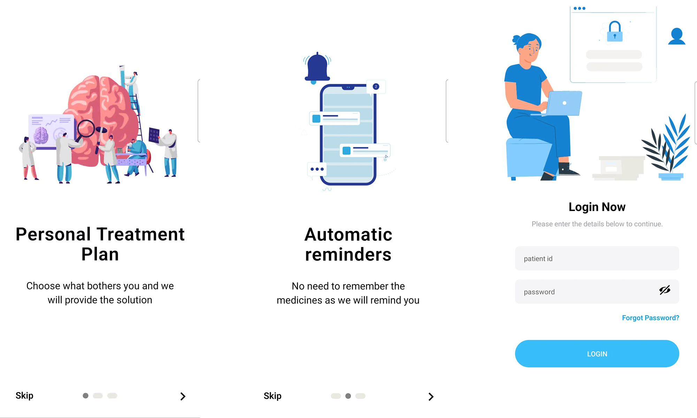
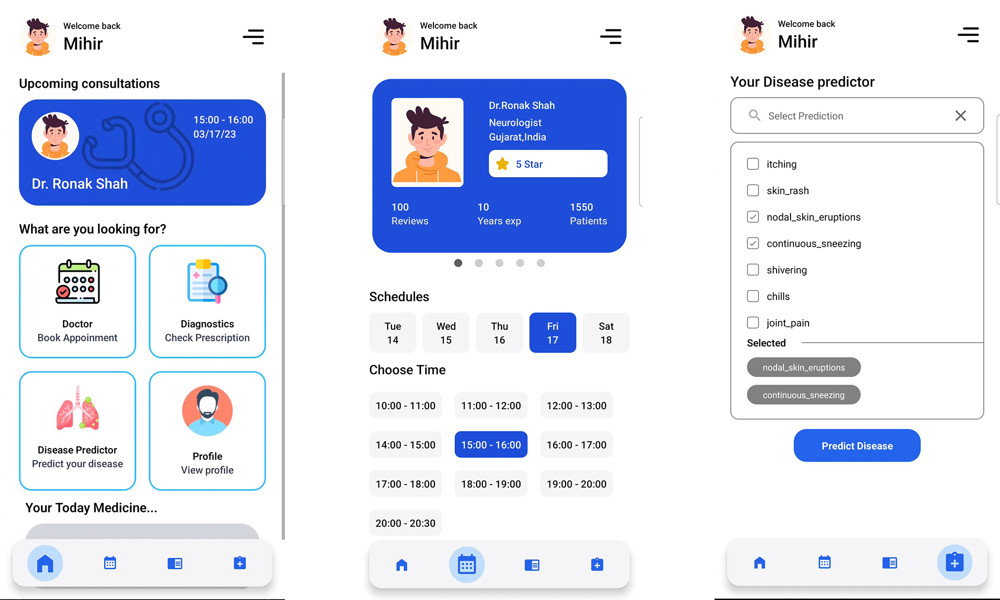
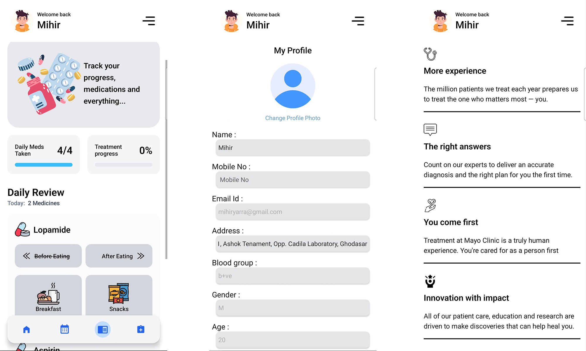

# Swasthya Healthcare Solution(SwasthyaMobileApp)
"Swasthya" Mobile App provide patient can make an appointment and also get a notification of when to take the medicine.

## Features

- <b>Patient</b> - Create Appoinment with Date and Time , get notification reminder for medicine , view all prescription.

## Tech Stack

Here we use these technical components :


**Client:** React Native, TailwindCSS

**Server:** Node, Express, MongoDB

## Run Locally

Clone the project

```bash
  git clone https://github.com/mirajsoliya/SwasthyaMobileApp.git
```

## to start the SERVER

Go to the project directory

```bash
  cd verifyIt-swasthya/backend
```

Install dependencies

```bash
  npm install
```

Run the project

```bash
  node Src/app.js
```

Note : Make sure to add .env file for enviorment variables.

## to start the Client Application(only for Patient)

Go to the project directory

```bash
  cd verifyIt-swasthyamobileapp/App.js
```

Install dependencies

```bash
  npm install
```

Run the project

```bash
  expo start
```

## Screenshots




